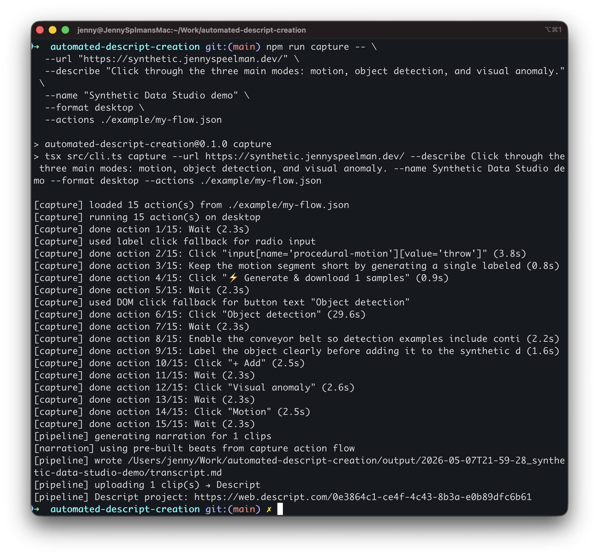

# automated-descript-creation

Automate demo videos for web apps via [Descript](https://descript.com).
You bring an app (or clips, or just an idea); the tool produces a Descript
project draft + a narration transcript ready for you to record your voice
over.

## Modes

| Mode      | Input                                                  | What it does                                                            |
| --------- | ------------------------------------------------------ | ----------------------------------------------------------------------- |
| `capture` | URL + a description (and optionally a click-through plan) | Drives the app in headless Chromium, records the run, builds beats per step. |
| `stitch`  | A folder of clips you recorded yourself                | Uploads them in order; auto-detects durations via `ffprobe`.            |
| `mock`    | Just a prompt / feature description                    | Generates title-card SVG slides so you can record over them.            |

All three converge on the same output:

1. A **Descript project** created via the API, with your media on the timeline.
2. A `transcript.md` file with narration broken into beats, timed to the clips,
   so you can record voice in Descript directly into the project.
3. A `manifest.json` snapshot of inputs, durations, and beats.

## AI is optional

There is no built-in AI dependency. The tool produces the Descript project,
clips/slides, timing, and a `transcript.md` with narration placeholders for
you to fill in.

For real app demos, the recommended workflow is to ask Claude, ChatGPT Codex, or
another AI assistant to draft the `--actions` JSON file for you. Give it the
app URL, your demo goal, then ask for JSON matching the schema below. Save that
JSON and pass it with `--actions ./my-flow.json`.

Example prompt:

```text
Create a strict JSON action plan for this web app demo.

App URL: <url>
Demo goal: <what should happen in the video>

Take screenshots of the app. Use only elements that are visible now or clearly reached by earlier steps.

Use only these action types:
- { "type": "click", "text": "exact visible button or link text", "beat": "10-20 word narration cue" }
- { "type": "click", "selector": "CSS selector", "beat": "10-20 word narration cue" }
- { "type": "fill", "selector": "CSS selector", "value": "what to type", "beat": "10-20 word narration cue" }
- { "type": "scroll", "direction": "down", "durationMs": 4000, "beat": "10-20 word narration cue" }
- { "type": "wait", "durationMs": 1500, "beat": "10-20 word narration cue" }
- { "type": "press", "key": "Enter", "beat": "10-20 word narration cue" }

Prefer click-by-text over selectors. Output JSON only:
{ "actions": [ ... ] }

Save it as ./my-flow.json

Also create a `transcript.md` file with narration broken into beats,
timed to the clips, so I can record my voice in Descript directly into the project
```

Without an `--actions` file:

- `capture` records an automated scroll tour.
- `mock` uses newlines or sentences in your `--describe` as slide headlines.
- `transcript.md` uses `[Write narration for ...]` placeholders.

`capture` and `stitch` accept optional `--description` text for transcript and
manifest context. If you omit it, the tool uses `--name`. The older
`--describe` flag still works as a compatibility alias for those two modes.

## Setup

```bash
npm install
npx playwright install chromium    # needed for capture mode only
cp .env.example .env               # add DESCRIPT_API_TOKEN; rest is optional
```

Get a Descript API token at Settings → API tokens. The Drive ID is optional
(inherited from the token by the import endpoint).

## Usage

```bash
# capture: drive a deployed app and record (default: 1080p desktop)
npm run capture -- \
  --url https://my-app.vercel.app \
  --description "Sign up flow, then create a project, then invite a teammate" \
  --name "MyApp demo"

# capture in BOTH desktop and mobile portrait (Shorts/Reels) in one run
npm run capture -- \
  --url https://my-app.vercel.app \
  --description "..." \
  --name "MyApp demo" \
  --format desktop,mobile

# capture an actual click-through (recommended for real demos)
npm run capture -- \
  --url https://my-app.vercel.app \
  --name "MyApp demo" \
  --actions ./my-flow.json

# stitch: bring your own clips
npm run stitch -- \
  --clips ./recordings/ \
  --description "What I built and why it's cool" \
  --name "MyApp demo"

# mock: prompt-only title-card slides
npm run mock -- \
  --describe "A todo app with AI subtask generation. 60 seconds." \
  --name "MyApp demo"
```

A live example:

```bash
npm run capture -- \
  --url "https://synthetic.jennyspeelman.dev/" \
  --name "Synthetic Data Studio demo" \
  --format desktop \
  --actions ./example/my-flow.json
```

During capture, the terminal prints action-by-action progress and fallback
notes. The Descript link appears after import processing and a Descript
post-process pass completes. For `--actions` runs, that pass fits the video to
the canvas and asks Descript to split the recording into action-level
clips/scenes:



To check the raw recording before creating a Descript project, add
`--no-upload` and open the generated `.webm` under `output/<run-id>/raw/`:

## Click-through actions

By default `capture` does an automated scroll tour. To actually drive the UI
through specific steps, pass an action plan with `--actions <path>`. You can
write it yourself or ask Claude, ChatGPT, or another AI assistant to make it
from your demo goal plus a screenshot of the app. See `example/my-flow.json`
for a minimal example. Schema:

```json
{
  "actions": [
    { "type": "click",  "text": "Visible button text",      "beat": "what to narrate" },
    { "type": "click",  "selector": ".my-css-selector",     "beat": "..." },
    { "type": "fill",   "selector": "input[name=email]",
                         "value": "demo@example.com",        "beat": "..." },
    { "type": "scroll", "direction": "down", "durationMs": 4000, "beat": "..." },
    { "type": "wait",   "durationMs": 1500,                  "beat": "..." },
    { "type": "press",  "key": "Enter",                      "beat": "..." }
  ]
}
```

`click` prefers `text` (Playwright's `getByText`, robust to layout changes)
over `selector`. The `beat` field (or `description`, as an alias) is what the
speaker narrates while that step is on screen.

Each action gets its own time-ranged beat in `transcript.md` — so when you
record voiceover in Descript, you know exactly what to say while each step
plays back.

When `DESCRIPT_API_TOKEN` is set, `--actions` also sends those same timestamps
to Descript after import. Descript Agent is asked to split the recording into
one timeline clip/scene per action and attach each action's `beat` or
`description` text as the clip/scene description, note, marker, or comment.

If a click fails (e.g. the named button isn't on screen), the run logs a
warning and continues. Bad steps just become silent gaps; the rest of the
flow still records.

## Capture formats

`--format` accepts a comma-separated list. Pick one or many. With multiple
formats, the tool creates **one Descript project per format** — each with a
composition that matches its clip's aspect ratio (a 9:16 mobile clip
in a 16:9 composition gets letterboxed; this avoids that). Output lands
under `output/<run-id>/<format>/` per group.

| Format          | Viewport / Video | Use for                                       |
| --------------- | ---------------- | --------------------------------------------- |
| `desktop`       | 1920 × 1080      | YouTube desktop (default)                     |
| `desktop-4k`    | 3840 × 2160      | 4K master — text will be small on 1920-design apps |
| `desktop-720p`  | 1280 × 720       | Drafts, low bandwidth                         |
| `mobile`        | 1080 × 1920      | YouTube Shorts, Instagram Reels, TikTok       |
| `mobile-720p`   |  720 × 1280      | Smaller mobile cuts                           |

Viewport and recording size are 1:1 — that's deliberate. Playwright records
the framebuffer at the logical viewport, so a recording size larger than the
viewport gets gray letterbox padding instead of pixel-perfect output.

During capture, the tool also hides horizontal page overflow and installs a
continuous horizontal scroll lock. This keeps apps with wide canvases or side
panels from sliding sideways in the raw `.webm` when Playwright focuses or
scrolls a target into view.

The 4K trade-off: at a 3840-wide viewport, apps designed around 1920 desktop
breakpoints render with everything taking half the relative space, so text
looks tiny. If your app is responsive enough to look good at 4K, use
`--format desktop-4k`; otherwise `desktop` (1080p) is the better default.

Mobile formats also set `isMobile: true` and `hasTouch: true` so your app's
mobile breakpoints fire.

## Output

Output lands in `./output/<run-id>/` (or `<run-id>/<format>/` per group when
multiple formats are captured):

- `descript-link.txt` — link to the draft project in Descript
- `transcript.md` — narration script (or placeholder slots), with timestamps
- `manifest.json` — what was uploaded, in what order, with durations
- `raw/` — the local media files (e.g. `desktop.webm`, `mobile.webm`)

## Status

Working scaffold. Verified live against the Descript API: capture, stitch, and
mock all produce real Descript projects.

Known limitations:

- `capture` action flow handles click/fill/scroll. Multi-page navigation
  works as long as Playwright can find each step's target by text or selector.
- Slides are SVG — Descript's importer accepts them.
- `publishComposition` is implemented but untested end-to-end (no completed
  draft to publish yet).

## Descript API surface used

- `POST /v1/jobs/import/project_media` — create project + composition with media
  in one round trip; response returns signed `upload_urls` per media key.
- `POST /v1/jobs/agent` — post-process imported capture projects: fit the
  recording to the canvas, and for `--actions` runs split the composition into
  action-level clips/scenes with the beat text attached.
- `POST /v1/jobs/publish` — render and publish a composition.
- `GET /v1/jobs/{id}` — poll job status (transcription, processing).
- `GET /v1/status` — sanity check + drive_id discovery.
